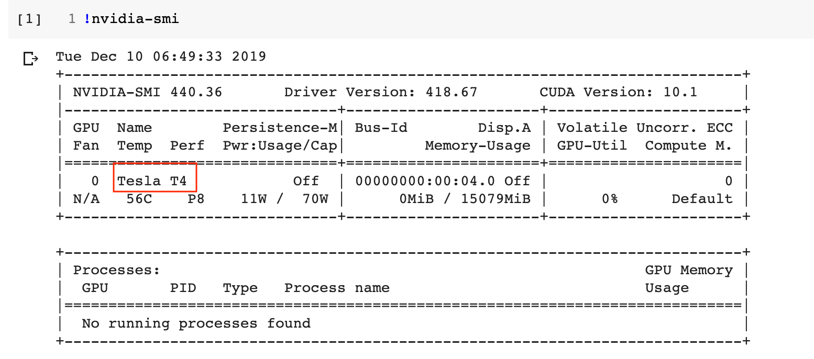

## EE 4178 (2019 Fall)

인공지능(딥러닝) 개론

* 교재: [Deep Learning with Python - Francois Chollet](https://www.pdfdrive.com/deep-learning-with-python-e54511249.html)
* 실습환경:
  * 언어: Python 3.6 (Python 3.5+) | [[점프 투 파이썬](https://wikidocs.net/book/1)] [[Python basic](https://wikidocs.net/book/1553)] [[파이썬 코딩도장](https://dojang.io/course/view.php?id=7)]
  * 딥러닝 프레임워크: PyTorch 1.3 (PyTorch 1.2+) | [[홈페이지](https://pytorch.org)]
  * 환경: Google Colab | [[홈페이지](https://colab.research.google.com/notebooks/welcome.ipynb)] [[사용법](https://drive.google.com/open?id=11B7cjkW0KVMZv-yqxHDhg0TUE3CESYSx)]

<br>

## Table of Contents

### 1. Basics

* [PyTorch 개론 (+Google Colab 사용법)](https://nbviewer.jupyter.org/github/gamchanr/TA-EE4178/blob/master/01-basics/intro_pytorch/intro_pytorch.ipynb) - [[Full Code](https://github.com/gamchanr/TA-EE4178/blob/master/01-basics/intro_pytorch/intro_pytorch.py)]
* [Binary Classification 모델 만들기 (XOR)](https://nbviewer.jupyter.org/github/gamchanr/TA-EE4178/blob/master/01-basics/classification/classification.ipynb) - [[Full Code](https://github.com/gamchanr/TA-EE4178/blob/master/01-basics/classification/binary_classification-xor.py)] | [IMDB] | [Face Recognizer]
* [Multi-class Classification 모델 만들기 (MNIST)](https://nbviewer.jupyter.org/github/gamchanr/TA-EE4178/blob/master/01-basics/classification/classification.ipynb#border1) - [[Full Code](https://github.com/gamchanr/TA-EE4178/blob/master/01-basics/classification/multiclass_classification-mnist.py)]
* Linear Regression 모델 만들기 (Boston Housing Price)
* Log Regression 모델 만들기

### 2. Intermediate

* [CNN(Convolutional Neural Network) (MNIST)](https://nbviewer.jupyter.org/github/gamchanr/TA-EE4178/blob/master/02-intermediate/CNN/cnn.ipynb?flush_cache=true) - [[Full Code - Train](https://github.com/gamchanr/TA-EE4178/blob/master/02-intermediate/CNN/cnn.py) / [Full Code - Test](https://github.com/gamchanr/TA-EE4178/blob/master/02-intermediate/CNN/test.py)] | [[CIFAR-10](https://github.com/gamchanr/TA-EE4178/blob/master/02-intermediate/CNN/cifar10.py)]
* [RNN(Recurrent Neural Network) (MNIST)](https://github.com/gamchanr/TA-EE4178/blob/master/02-intermediate/RNN/RNN.ipynb) - [[Full Code](https://github.com/gamchanr/TA-EE4178/blob/master/02-intermediate/RNN/rnn.py)]
* Stytle Transfer
* [VAE(Varialtional Auto-Encoder)](https://github.com/gamchanr/TA-EE4178/blob/master/02-intermediate/VAE/VAE.ipynb) - [[Full Code](https://github.com/gamchanr/TA-EE4178/blob/master/02-intermediate/VAE/train.py)]
* GAN(Generative Adversarial Networks)


### 3. Advanced
* [Custom Dataloader](https://github.com/gamchanr/TA-EE4178/blob/master/03-advanced/custom_dataloader/custom_dataloader.ipynb) | [[Full Code](https://github.com/gamchanr/TA-EE4178/blob/master/03-advanced/custom_dataloader/font_dataset.py)]
* [Trasfer Learning (Using Pre-trained Model to Custom Case)](https://github.com/gamchanr/TA-EE4178/blob/master/03-advanced/transfer_learning/transfer_learning.ipynb) - [[Full code](https://github.com/gamchanr/TA-EE4178/blob/master/03-advanced/transfer_learning/post_train.py)] | [[custom data](https://github.com/gamchanr/TA-EE4178/blob/master/03-advanced/transfer_learning/cnn.py)] | [[pre-trained model](https://github.com/gamchanr/TA-EE4178/blob/master/03-advanced/transfer_learning/cnn.py)] 
* Model Customizing base on Existing Model
  
### 4. Experts
* Paper Implemention  
* Custom Modeling
* Pytorch for Mobile [ios / android]

<!---
https://hackernoon.com/binary-face-classifier-using-pytorch-2d835ccb7816
https://m.blog.naver.com/PostView.nhn?blogId=gkvmsp&logNo=221485860027&proxyReferer=https%3A%2F%2Fwww.google.com%2F

cf. Training Tips

- Train-Val-Test / Overfitting-Underfitting
- Data Augmentation

--->

<br>

## Final Project
1. [프로젝트개요](https://drive.google.com/open?id=1VYOuNUQQynr9hX2WcEqzAGGCBl5vukRH)
2. 데이터셋 - [[train](https://drive.google.com/open?id=1Gx-1Gj3YLR7r4kYIMDJMnF1GtKYPMvbQ)] / [[validation](https://drive.google.com/open?id=1T8KSOgAVpKsJFWgNMeVfLgTnKQSp1VeB)]
3. [데이터 로드를 위한 참고 코드 (font_dataset.py)](https://github.com/gamchanr/TA-EE4178/blob/master/utils/font_dataset.py)

#### 프로젝트 추가공지 (GPU환경 확인 및 실행 시간 출력)
* Colab에서 제공되는 GPU종류가 총 5종류(NVIDIA Tesla K80, P100, P4, T4, V100 GPU)로 이는 지정할 수 없고, 세션이 연결될 시 랜덤으로 배정되는 것으로 확인됩니다. 이에 따라 GPU 동작시간에 차이가 발생할 수 있습니다.   
* 현재 할당된 GPU가 아닌 다른 GPU를 할당받고 싶으신 경우, 세션을 끊었다가 다시 연결하면 변경되는 경우가 있습니다. (배정되는 GPU를 그냥 사용하실 분은 그대로 진행하시면 됩니다.)  
* <u>**train.ipynb 제출 시 아래 두 코드도 추가하여, 보고서에 '어떤 환경에서 소요시간이 얼마인지' 함께 기재해 주시기 바랍니다.**</u>
 1. GPU 환경 확인 (Colab GPU:  중 실행됨): `!nvidia-smi`  
 
 2. 코드 실행 시간 출력
```  
import time  
   
start_time = time.time()  
          
### 학습코드 예시  
time.sleep(2)  
###  
  
duration = time.time() - start_time  
print(duration) # 2.003 (초)가 출력됨
```
